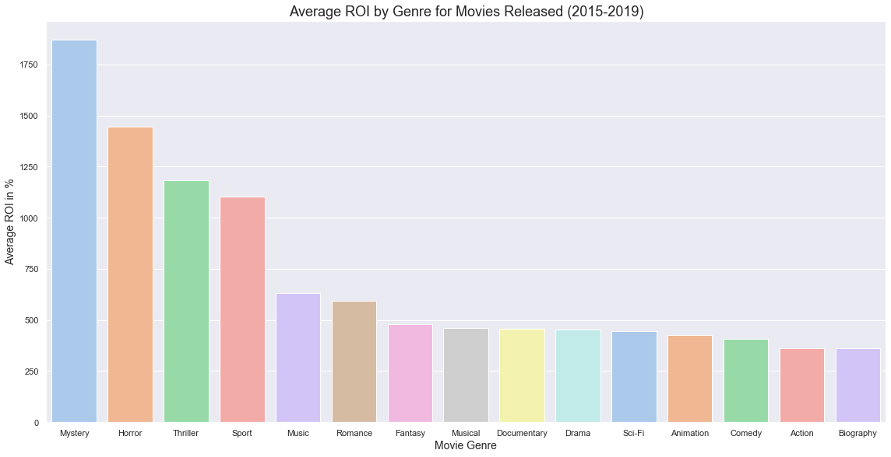
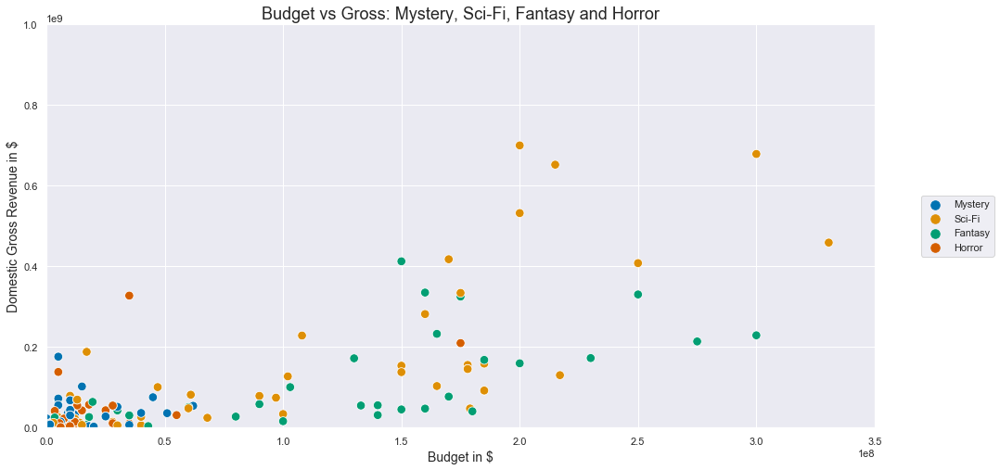

# Microsoft Movie Studio: Data-Driven Analysis of Movie Genres


### The Data

The data used here comes from some of the most well-known and reliable sources in the industry, such as IMDB and Box Office Mojo, IMDB Pro's box office portal. Put together, these datasets contain information about thousands of movies, their box office performance domestically, and worldwide and rating score by IMDB users. Also, a dataset scraped from The Numbers contains production budget information for almost 6,000 successful movies. 

In the folder ```data``` are movie datasets from:

- Box Office Mojo
- IMDB
- Rotten Tomatoes
- TheMovieDB.org
- The Numbers

### The Challenge 

To help Microsoft decide what type of movies they should look into producing first, genre performance of recently released movies will be analyzed alongside user ratings and revenue at the box office. 

Thus, this analysis is focused on the three questions below: 

#### 1. What genres of movies have received the most favorable ratings on IMDB?

With over 83 million users, IMDB is the most popular website for movie lovers and one of the most frequently used platforms where they express their opinion on new and old films. Users do so by writing reviews or assigning a user rating on a scale from 1-10. For the purpose of this analysis, audience reception will be measured by the IMDB average user rating. 

The genres that accumulated favorable ratings (7 or above) are likely to be best received and most appreciated by movie-goers. To explore this question,s genres were divided into three subsets of five genres and presented in a histogram. Here's the example for the first subset:


**Key Takeaways:**

- If a movie's goal is to receive raving reviews from the audience, producing a fiction movie that includes biographical or historical components is a pretty safe way to get you there. Alternatively, making a documentary also has higher than average chances to receive favorable ratings from movie-goers. 
 
 
- If audience ratings are of lesser importance,  producing Romance is a safe bet, while Sci-Fi and Fantasy movies can be both really well-received and thoroughly disliked by the audience.


#### 2. What genres of movies have shown the highest ROI in the last five years?

Though filmmaking is an art form, running a movie production studio is profit-driven, like any other business venture. Hugely successful blockbuster movies are known to produce astronomical ROI (e.g., the very first Star Wars movie in the 70s had a 2500% ROI). In this next phase, the analysis explores the relationship between genres and ROI.



**Key Takeaways:**

 - If you are aiming for high risk, high reward type of movie, your best bet is produce a high-budget Sci-Fi/Thriller/Fantasy film.
 - If you want to achieve more with less, focus on producing high-quality Thrillers. Their budgets average below $100M but they are also likely to provide an ROI in the 750-1000% range.

#### 3. What genres of movies do the leading 10 production studios produce the most? 

Being the new kid on the block can be intimidating, especially when you have to compete with industry titans that have dominated the movie markets for decades. Let's take a look at what the ten most successful studios are doing with their projects, movies of which genre they produce the most.  It will then be helpful to explore how these particular genres perform with revenue and ratings within the context of these ten studios only.

Based on the takeaways from the previous questions, let's explore how the Sci-Fi, Fantasy, Mystery and Horror movies produced only by the top 10 production studios perform in terms budget vs. gross, and then in terms of user ratings.




**Key Takeaway**
- Investing in a high-quality Fantasy/Sci-Fi movie will be a great way to launch a movie studio for Microsoft. Not only are these genres not as saturated as others, but they have the highest potential to perform exceptionally well both at the box office and with fans, generating high ROI and favorable user ratings.

## PRESENTATION

Slideshow is available in the repository as a PDF document.

[Link to Video Presentation!](https://drive.google.com/file/d/1p0-i7II-as-eIaHkPjelQPHsB2YmXaRC/view)

